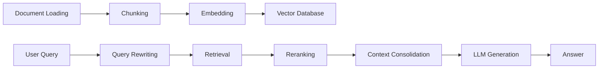

---
tags:
  - llm
  - rag
---

# RAG Workflow Overview

```mermaid
flowchart LR
A[Document Loading] --> B[Chunking]
B --> C[Embedding]
C --> D[Vector Database]
E[User Query] --> F[Query Rewriting]
F --> G[Retrieval]
G --> H[Reranking]
H --> I[Context Consolidation]
I --> J[LLM Generation]
J --> K[Answer]
```

## Three Main Stages

1. Indexing
2. Retrieval
3. Generation
