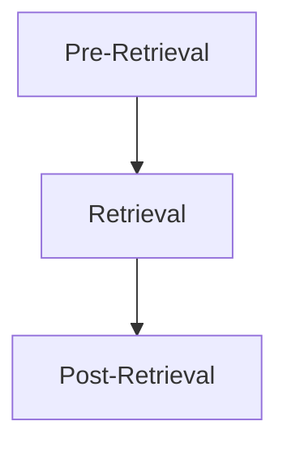

---
tags:
  - llm
  - rag
---

# Advanced RAG Overview

Advanced RAG is not one single technique. It is a set of engineering optimizations around common RAG failure points.

## Key Idea

Improve query quality, retrieval quality, and context quality before generation.
